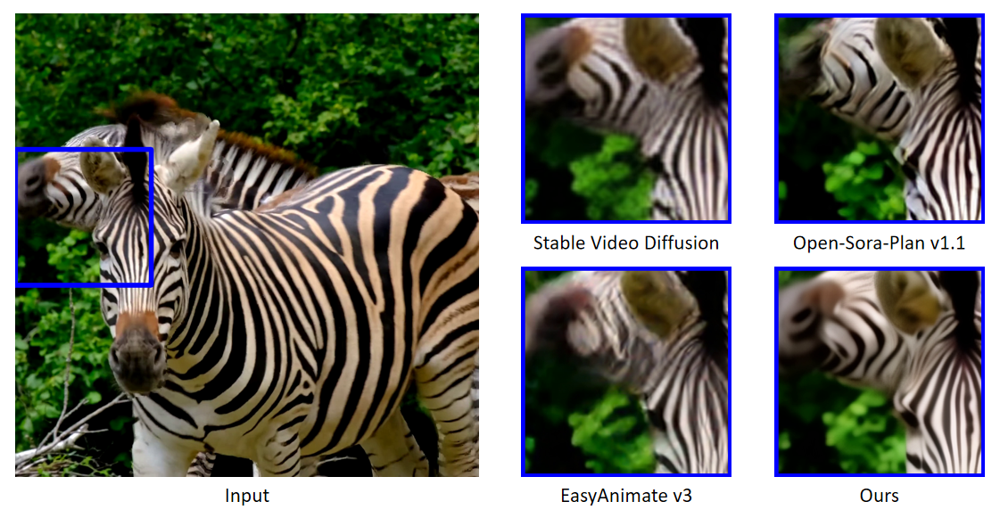
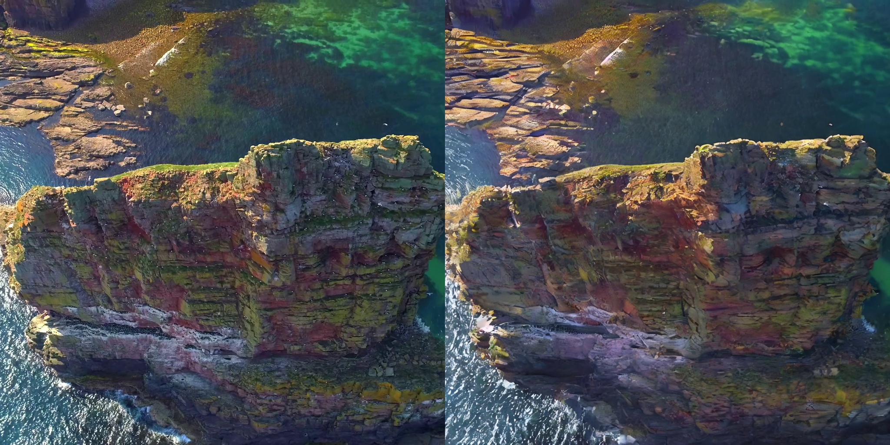
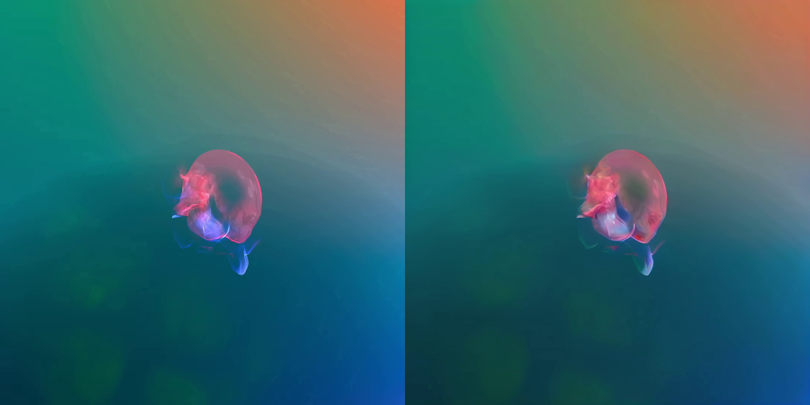
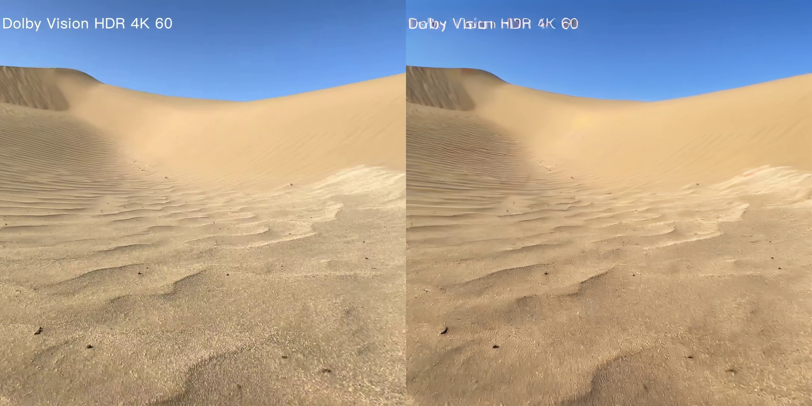
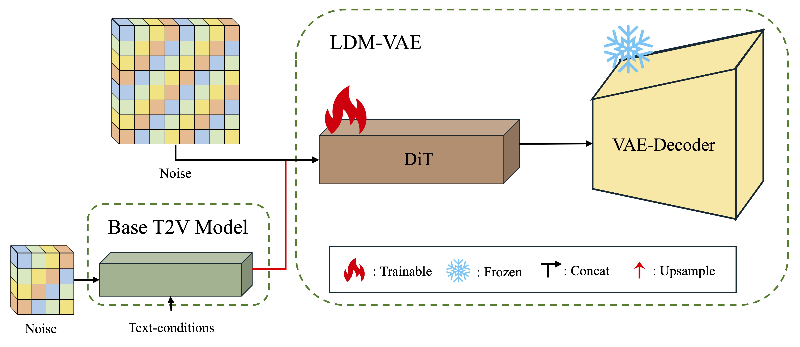
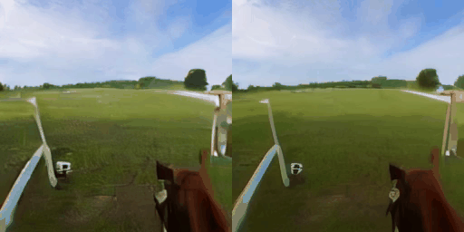
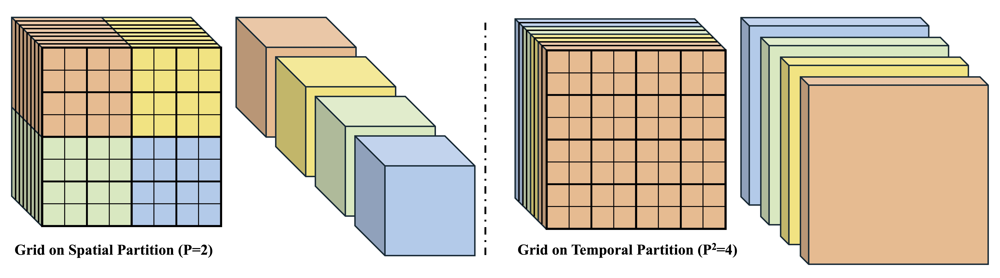
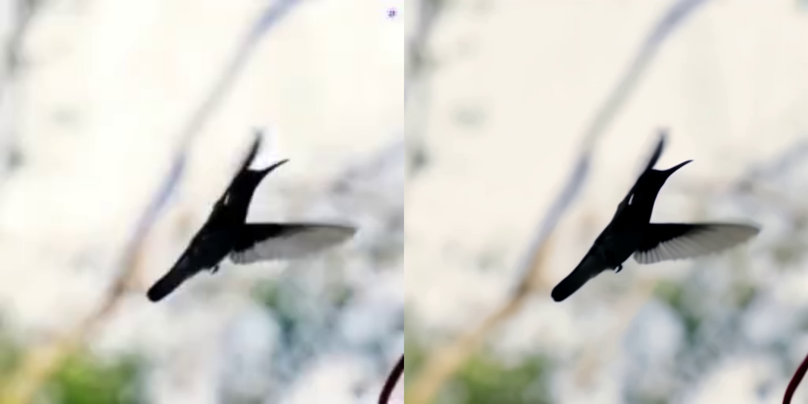

# CascadeV | An Implemention of Würstchen architecture for High-Resolution Video Generation

## News

**[2024.07.17]** We release the code and pretrained weights of a DiT-based video VAE, which supports video reconstruction with a high compression factor (1x32x32=1024). The T2V model is still on the way.

## Introduction

CascadeV is a video generation pipeline built upon the [Würstchen](https://openreview.net/forum?id=gU58d5QeGv) architecture. By using a highly compressed latent representation, we can generate longer videos with higher resolution.

## Video VAE

Comparison of Our Cascade Approach with Other VAEs (on Latent Space of Shape 8x32x32)



Video Recontruction: Original (left) vs. Reconstructed (right) | *Click to view the videos*

<table class="center">
<tr>
  <td><a href='docs/1.mp4'></a></td>
  <td><a href='docs/2.mp4'></a></td>
</tr>
<tr>
  <td><a href='docs/3.mp4'></a></td>
  <td><a href='docs/4.mp4'></a></td>
</tr>
</table>

### 1. Model Architecture



#### 1.1 DiT

We use [PixArt-Σ](https://github.com/PixArt-alpha/PixArt-sigma) as our base model with the following modifications:

* Replace the original VAE (of [SDXL](https://arxiv.org/abs/2307.01952)) with the one from [Stable Video Diffusion](https://github.com/Stability-AI/generative-models).
* Use sematic compressor from [StableCascade](https://github.com/Stability-AI/StableCascade) to provide the low-resolution latent input. 
* Remove text encoder and all multi-head cross-attention layers since we are not using text condition.
* Replace all 2D attention layers to 3D. We find that 3D attention outperforms 2+1D (i.e. alternative spatial and temporal attention), especially in temporal consistency.

Comparison of 2+1D Attention (left) vs. 3D Attention (right)



#### 1.2. Grid Attention

Using 3D attention requires much more computational resources than 2D/2+1D, especially with higher resolution. As a compromise solution, we replace some 3D attention layers with alternative spatial and temporal grid attention.



### 2. Evaluation

Dataset: We perform qualitative comparison with other baselines on the dataset [Inter4K](https://alexandrosstergiou.github.io/datasets/Inter4K/index.html), by sampling the first 200 videos from the Inter4K to create a video dataset with a resolution of 1024x1024 and 30 FPS.

Metrics: We use PSNR, SSIM and LPIPS to evaluate the per-frame quality (and the similarity between original and reconstructed video) and [VBench](https://github.com/Vchitect/VBench) to evaluate the video quality independently.

#### 2.1 PSNR/SSIM/LPIPS

Diffusion-based VAEs (like StableCascade and our model) performs poorly in reconstruction metrics, due to their ability to produce videos with more fine-grained details but less similiar to the original ones.

| Model/Compression Factor | PSNR↑ | SSIM↑ | LPIPS↓ |
| -- | -- | -- | -- |
| Open-Sora-Plan v1.1/4x8x8=256 | 25.7282 | 0.8000 | 0.1030 |
| EasyAnimate v3/4x8x8=256 | **28.8666** | **0.8505** | **0.0818** |
| StableCascade/1x32x32=1024 | 24.3336 | 0.6896 | 0.1395 |
| Ours/1x32x32=1024 | 23.7320 | 0.6742 | 0.1786 |

#### 2.2 VBench

Our approach has comparable performance to the previous VAEs in both frame-wise and temporal quality even with much larger compression factor.  

| Model/Compression Factor | Subject Consistency | Background Consistency | Temporal Flickering | Motion Smoothness | Imaging Quality | Aesthetic Quality |
| -- | -- | -- | -- | -- | -- | -- |
| Open-Sora-Plan v1.1/4x8x8=256 | 0.9519 | 0.9618 | 0.9573 | 0.9789 | 0.6791 | 0.5450 |
| EasyAnimate v3/4x8x8=256 | 0.9578 | **0.9695** | 0.9615 | **0.9845** | 0.6735 | 0.5535 |
| StableCascade/1x32x32=1024 | 0.9490 | 0.9517 | 0.9430 | 0.9639 | **0.6811** | **0.5675** |
| Ours/1x32x32=1024 | **0.9601** | 0.9679 | **0.9626** | 0.9837 | 0.6747 | 0.5579 |

### 3. Usage

#### 3.1 Installation

Recommend to use Conda

```
conda create -n cascadev python==3.9.0
conda activate cascadev
conda install pytorch==2.0.1 torchvision==0.15.2 torchaudio==2.0.2 pytorch-cuda=11.7 -c pytorch -c nvidia
```

Install [PixArt-Σ](https://github.com/PixArt-alpha/PixArt-sigma)

```
bash install.sh
```

#### 3.2 Download Pretrained Weights

```
bash pretrained/download.sh
```

#### 3.3 Video Reconstruction

A sample script for video reconstruction with compression factor of 32

```
bash recon.sh
```

Results of Video Reconstruction: w/o LDM (left) vs. w/ LDM (right)



*It takes almost 1 minutes to reconstruct a video of shape 8x1024x1024 with one NVIDIA-A800*

#### 3.4 Train VAE

* Replace "video_list" in configs/s1024.effn-f32.py with your own video datasets
* Then run

```
bash train_vae.sh
```

## Acknowledgement
* [PixArt-Σ](https://github.com/PixArt-alpha/PixArt-sigma): The **main codebase** we built upon.
* [StableCascade](https://github.com/Stability-AI/StableCascade): Würstchen architecture we used.
* Thanks [Stable Video Diffusion](https://github.com/Stability-AI/generative-models) for its amazing Video VAE.
